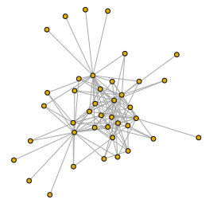

# ICON: easy access to complex systems datasets

[](https://travis-ci.org/rrrlw/ICON)
[](https://ci.appveyor.com/project/rrrlw/ICON)

[](http://creativecommons.org/publicdomain/zero/1.0/)
[](https://CRAN.R-project.org/package=ICON)
[](https://CRAN.R-project.org/package=ICON)

## Overview

The ICON R package provides easy-to-use and easy-to-access datasets from the Index of COmplex Networks (ICON) database available at the University of Colorado website.
All datasets can be loaded with a single function call and new datasets are being slowly added from ICON at <https://icon.colorado.edu>.

## Installation

To install the ICON package, run the following R code:
```r
# install from CRAN (fewer networks)
install.packages("ICON")

# install development version from GitHub (more networks)
devtools::install_github("rrrlw/ICON")
```

## Sample code

```r
# load network of bird and plant interactions
library("ICON")
data("seed_disperse")

# plot interaction network using igraph
library("igraph")
my_graph <- graph_from_edgelist(as.matrix(seed_disperse[, 1:2]), directed = FALSE)
plot(my_graph, vertex.label = NA, vertex.size = 5)
```

 <br>

## Contribute

See contribution guidelines [here](https://github.com/rrrlw/ICON/blob/master/CONTRIBUTING.md).
First-timers and beginners are welcome!
